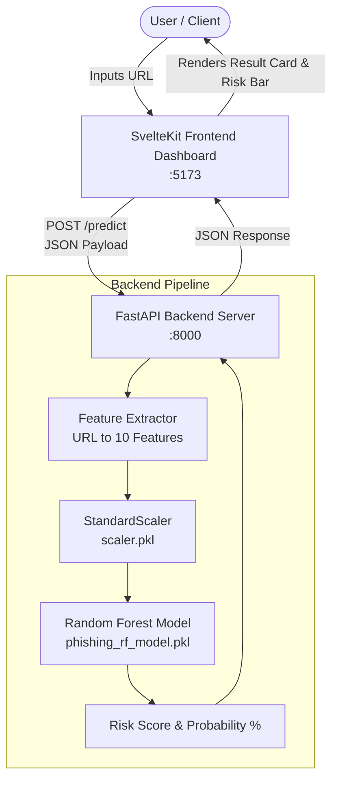

# 🛡️ Phishing URL Shield — Real-Time ML Phishing Detection Application

[](https://fastapi.tiangolo.com/)
[](https://svelte.dev/)
[](https://scikit-learn.org/)
[](https://www.python.org/)
[](https://www.typescriptlang.org/)
[](https://vitejs.dev/)

An end-to-end, full-stack Machine Learning web application designed for real-time URL analysis and phishing threat classification. It extracts 10 core numerical lexical features from any input URL and leverages a trained **Random Forest Classifier** to compute an instant threat risk score and safety verdict.

---

## 📑 Table of Contents

- [Overview](#-overview)
- [System Architecture](#-system-architecture)
- [Machine Learning Pipeline](#-machine-learning-pipeline)
  - [Dataset](#dataset)
  - [Extracted Features (10 Key Metrics)](#extracted-features-10-key-metrics)
  - [Model Performance](#model-performance)
- [Tech Stack](#-tech-stack)
- [Project Directory Structure](#-project-directory-structure)
- [Getting Started & Installation](#-getting-started--installation)
  - [Prerequisites](#prerequisites)
  - [1. Backend Setup](#1-backend-setup)
  - [2. Frontend Setup](#2-frontend-setup)
- [Running the Application](#-running-the-application)
- [REST API Reference](#-rest-api-reference)
  - [Health Check](#1-health-check)
  - [Single URL Prediction](#2-single-url-prediction)
  - [Batch URL Prediction](#3-batch-url-prediction)
  - [Model Information](#4-model-information)
  - [Scan History](#5-scan-history)
- [How It Works](#-how-it-works)
- [License](#-license)

---

## 🌟 Overview

Cybercriminals frequently employ deceptive URLs, brand spoofing, and obscure subdomain configurations to trick users into revealing sensitive credentials. **Phishing URL Shield** provides instant URL security analysis by:

1. Accepting raw URLs via an interactive dark-themed web dashboard or REST API.
2. Converting the URL into 10 lexical, structural, and semantic numerical features without needing slow external network crawling.
3. Scaling and normalizing the feature vector with `StandardScaler`.
4. Passing the features through an ensemble **Random Forest Classifier**.
5. Displaying the risk percentage, binary classification (`Legitimate / Safe` vs `Phishing / Malicious`), and a detailed breakdown of extracted features and historical scans.

---

## 🏗 System Architecture



---

## 🧠 Machine Learning Pipeline

### Dataset
- **Source**: Comprehensive dataset of 11,430 verified legitimate and phishing URLs (`dataset_phishing.csv`).
- **Target Distribution**: Balanced binary classification (`legitimate: 0`, `phishing: 1`).
- **Exploration & Training**: Carried out in `ml-pipeline/notebook/app.ipynb`.

### Extracted Features (10 Key Metrics)

The model evaluates URLs across 10 critical lexical and structural attributes:

| # | Feature Name | Description | Type / Range |
|---|--------------|-------------|--------------|
| 1 | `length_url` | Total character length of the URL string | Integer (e.g. 24) |
| 2 | `nb_dots` | Count of period (`.`) characters in the URL | Integer (e.g. 1) |
| 3 | `nb_hyphens` | Count of hyphen (`-`) characters in the URL | Integer (e.g. 0) |
| 4 | `nb_slash` | Count of forward slash (`/`) characters in the URL | Integer (e.g. 2) |
| 5 | `nb_subdomains` | Number of domain sub-parts / subdomains | Integer (e.g. 1) |
| 6 | `prefix_suffix` | Presence of hyphens (`-`) in the domain hostname | Binary (`0` or `1`) |
| 7 | `shortening_service` | Whether the domain matches known shorteners (`bit.ly`, `tinyurl.com`, `t.co`, etc.) | Binary (`0` or `1`) |
| 8 | `phish_hints` | Presence of sensitive keywords (`login`, `verify`, `banking`, `account`, `wallet`, etc.) | Binary (`0` or `1`) |
| 9 | `ip` | Whether the hostname is a raw IP address (e.g. `192.168.1.1`) | Binary (`0` or `1`) |
| 10 | `https_token` | Protocol security indicator (`1` for insecure HTTP, `0` for HTTPS) | Binary (`0` or `1`) |

### Model Performance

| Metric | Random Forest Benchmark |
|--------|:-----------------------:|
| **Accuracy** | **~83.0%** |
| **Precision** | **0.852** |
| **Recall** | **0.796** |
| **F1-Score** | **0.823** |
| **Estimators** | 150 Decision Trees |

---

## 💻 Tech Stack

### **Backend**
- **Framework**: [FastAPI](https://fastapi.tiangolo.com/) — High-performance asynchronous REST API.
- **Server**: [Uvicorn](https://www.uvicorn.org/) — ASGI web server.
- **Validation**: [Pydantic v2](https://docs.pydantic.dev/) — Strict request/response parsing and data validation.
- **Machine Learning**: [scikit-learn](https://scikit-learn.org/), [joblib](https://joblib.readthedocs.io/), [pandas](https://pandas.pydata.org/), [numpy](https://numpy.org/).

### **Frontend**
- **Framework**: [SvelteKit 2](https://kit.svelte.dev/) with [Svelte 5 Runes](https://svelte.dev/).
- **Language**: TypeScript.
- **Build Tool**: [Vite](https://vitejs.dev/).
- **UI & Styling**: Modern responsive dark UI with custom CSS variables, risk gauges, and reactive components.

---

## 📂 Project Directory Structure

```text
Phishing-URL-Detecting-Application/
├── app/
│   ├── backend/
│   │   └── main.py              # FastAPI application, feature extraction, API routes
│   └── frontend/
│       ├── src/
│       │   ├── lib/
│       │   │   ├── components/
│       │   │   │   ├── Header.svelte         # Application header with live health status
│       │   │   │   ├── UrlScanner.svelte     # URL input form and scan triggers
│       │   │   │   ├── ResultCard.svelte     # Risk score bar and analysis breakdown
│       │   │   │   ├── HistoryPanel.svelte   # Recent scan logs table
│       │   │   │   └── ModelInfo.svelte      # Feature importance weights and metrics
│       │   │   ├── services/
│       │   │   │   └── phishing-api.ts       # Frontend REST client communicating with backend
│       │   │   └── types/
│       │   │       └── phishing.ts           # TypeScript interfaces and response types
│       │   └── routes/
│       │       └── +page.svelte              # Main application dashboard
│       ├── package.json
│       ├── tsconfig.json
│       └── vite.config.ts
├── ml-pipeline/
│   ├── dataset/
│   │   └── dataset_phishing.csv # 11,430 sample phishing dataset
│   ├── model/
│   │   ├── phishing_rf_model.pkl# Serialized Random Forest model artifact
│   │   ├── scaler.pkl           # StandardScaler artifact
│   │   └── features_list.pkl    # Serialized feature list
│   └── notebook/
│       └── app.ipynb            # Jupyter notebook for training, EDA & evaluation
├── requirements.txt             # Python dependencies
└── README.md                    # Project documentation
```

---

## 🚀 Getting Started & Installation

### Prerequisites
- **Python**: `>= 3.10`
- **Node.js**: `>= 18.x`
- **npm**: `>= 9.x`

---

### 1. Backend Setup

1. Open your terminal and navigate to the project root directory:
   ```bash
   cd Phishing-URL-Detecting-Application
   ```

2. Create and activate a Python virtual environment:
   ```bash
   python3 -m venv venv
   source venv/bin/activate    # On Linux/macOS
   # or: venv\Scripts\activate # On Windows
   ```

3. Install the required Python packages:
   ```bash
   pip install -r requirements.txt
   ```

---

### 2. Frontend Setup

1. Open a second terminal window and navigate to the `app/frontend` directory:
   ```bash
   cd Phishing-URL-Detecting-Application/app/frontend
   ```

2. Install the Node dependencies:
   ```bash
   npm install
   ```

---

## ⚡ Running the Application

### Start the FastAPI Backend
From the project root (with `venv` activated):
```bash
./venv/bin/uvicorn app.backend.main:app --host 0.0.0.0 --port 8000 --reload
```
- API Base URL: `http://127.0.0.1:8000`
- Interactive Swagger Documentation: `http://127.0.0.1:8000/docs`

### Start the SvelteKit Frontend
From the `app/frontend` directory:
```bash
npm run dev
```
- Web Application: [http://localhost:5173](http://localhost:5173)

---

## 📡 REST API Reference

### 1. Health Check
Checks if the server is running and the ML model artifacts are loaded.

- **Endpoint**: `GET /`
- **Response**:
  ```json
  {
    "status": "Online",
    "model_loaded": true,
    "algorithm": "Random Forest Classifier",
    "features_count": 10
  }
  ```

---

### 2. Single URL Prediction
Analyzes a single URL and computes phishing probability.

- **Endpoint**: `POST /predict`
- **Headers**: `Content-Type: application/json`
- **Request Body**:
  ```json
  {
    "url": "https://google.com"
  }
  ```
- **Response**:
  ```json
  {
    "url": "https://google.com",
    "is_phishing": false,
    "status": "Legitimate / Safe",
    "risk_score_percentage": 4.96,
    "features": {
      "length_url": 18,
      "nb_dots": 1,
      "nb_hyphens": 0,
      "nb_slash": 2,
      "nb_subdomains": 1,
      "prefix_suffix": 0,
      "shortening_service": 0,
      "phish_hints": 0,
      "ip": 0,
      "https_token": 0
    },
    "timestamp": "2026-09-18 22:36:58"
  }
  ```

---

### 3. Batch URL Prediction
Analyzes up to 100 URLs in a single request.

- **Endpoint**: `POST /predict-batch`
- **Headers**: `Content-Type: application/json`
- **Request Body**:
  ```json
  {
    "urls": [
      "https://github.com",
      "http://paypal-security-update.com/login.php",
      "http://192.168.1.1/login"
    ]
  }
  ```
- **Response**:
  ```json
  {
    "total_analyzed": 3,
    "results": [
      {
        "url": "https://github.com",
        "is_phishing": false,
        "status": "Legitimate / Safe",
        "risk_score_percentage": 4.96,
        "features": { ... },
        "timestamp": "2026-09-18 22:36:58"
      },
      {
        "url": "http://paypal-security-update.com/login.php",
        "is_phishing": true,
        "status": "Phishing / Malicious",
        "risk_score_percentage": 81.79,
        "features": { ... },
        "timestamp": "2026-09-18 22:36:58"
      },
      {
        "url": "http://192.168.1.1/login",
        "is_phishing": true,
        "status": "Phishing / Malicious",
        "risk_score_percentage": 91.48,
        "features": { ... },
        "timestamp": "2026-09-18 22:36:58"
      }
    ]
  }
  ```

---

### 4. Model Information
Retrieves model architecture metadata and relative feature importance weights.

- **Endpoint**: `GET /model-info`
- **Response**:
  ```json
  {
    "model_name": "Random Forest Classifier",
    "benchmark_test_accuracy": "82.31%",
    "benchmark_f1_score": "0.802",
    "total_features": 10,
    "feature_names": [
      "length_url",
      "nb_dots",
      "nb_hyphens",
      "nb_slash",
      "nb_subdomains",
      "prefix_suffix",
      "shortening_service",
      "phish_hints",
      "ip",
      "https_token"
    ],
    "feature_importance_weights": {
      "length_url": 28.14,
      "nb_slash": 19.52,
      "phish_hints": 14.88,
      "nb_dots": 12.05,
      "https_token": 8.71,
      "nb_hyphens": 6.32,
      "prefix_suffix": 4.90,
      "nb_subdomains": 3.12,
      "ip": 1.45,
      "shortening_service": 0.91
    },
    "estimators_count": 150
  }
  ```

---

### 5. Scan History
Retrieves the most recent URL scans logged during runtime.

- **Endpoint**: `GET /history`
- **Response**:
  ```json
  {
    "count": 5,
    "recent_scans": [
      {
        "url": "https://google.com",
        "status": "Legitimate / Safe",
        "risk": 4.96,
        "timestamp": "2026-09-18 22:36:58"
      }
    ]
  }
  ```

---

## 🔍 How It Works

1. **Input Normalization**: Checks whether protocol headers (`http://` or `https://`) are present.
2. **Lexical Parsing**: Extracts structural tokens including subdomains, domain length, character delimiters (`.`, `-`, `/`), shortening service matches, and IP patterns.
3. **Keyword Scanning (`phish_hints`)**: Scans for high-risk action words (`login`, `banking`, `verify`, `account`) that phishers typically embed in fake paths.
4. **Standard Scaling**: Centers and scales the feature vector against the training set distribution using `scaler.pkl`.
5. **Ensemble Voting**: 150 individual decision trees in the Random Forest independently vote to classify the probability of malicious intent.

---

## 📄 License

This project is licensed under the MIT License — feel free to use and adapt it for research, educational, or commercial cybersecurity purposes.
